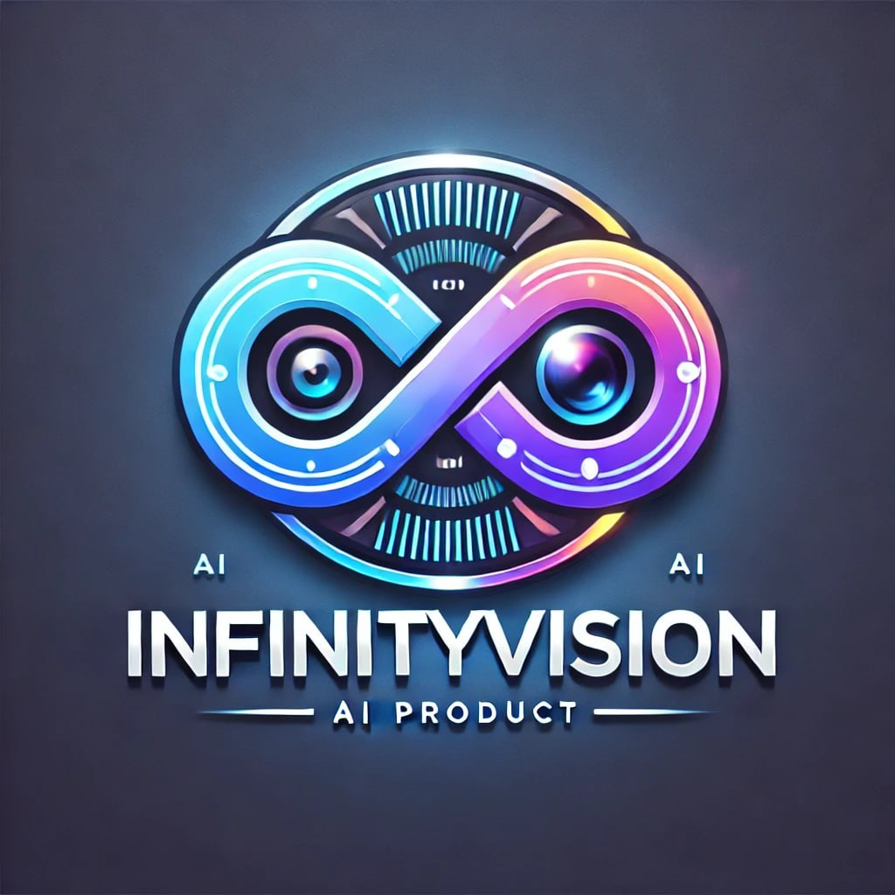
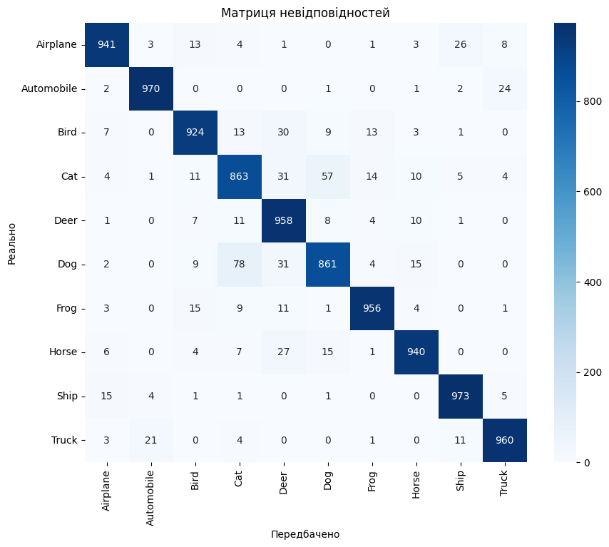

  

<h1>Вебзастосунок <i>InfinityVision</i></h1>

Розроблений командою <i>Infinity</i>, класифікує завантажені зображення за допомогою <i>Convolutional Neural Network</i>. Також, застосунок вміє автоматично знаходити відповіді на запитання з великого обсягу текстових даних із підвантаженого PDF документа, використовуючи Large Language Model.

Розроблений на базі фреймворку <a href="https://www.djangoproject.com/">Django</a>

Модель "model_3_finetuned.h5", що класифікує зображення, натренована на датасеті <a href="https://www.kaggle.com/c/cifar-10">CIFAR-10</a>.

<h2>Convolutional Neural Network</h2>
<h3>Основна модель Model_3_vgg16</h3>

<h4>Гіперпараметри:</h4>
<ul>
  <li>img_size: Встановлює розмір зображень у 128x128 пікселів.</li>
  <li>num_classes: Кількість класів для класифікації (10 класів у CIFAR-10).</li>
  <li>batch_size: Розмір батчу під час навчання (512).</li>
  <li>epochs: Кількість епох для навчання (5).</li>
</ul>

<h4>Створення базової моделі VGG16:</h4>
<ul>
  <li>VGG16: Використовується попередньо навчена модель VGG16 (без верхніх шарів), яка завантажує попередньо навчені ваги з ImageNet.</li>
  <li>base_model.trainable встановлюється у True, що дозволяє повторно навчати всі шари базової моделі.</li>
</ul>

<h4>Додавання класифікаційної частини:</h4>
<ul>
  <li>Flatten: Вихідні дані базової моделі згладжуються в один вектор.</li>
  <li>Dense (256 нейронів): Додається повнозв'язний шар з 256 нейронами та функцією активації ReLU.</li>
  <li>Dropout (0.5): Додається шар Dropout для запобігання перенавчанню.</li>
  <li>Dense (num_classes): Вихідний шар із 10 нейронами (по одному на кожен клас) та функцією активації Softmax.</li>
</ul>

<h4>Компіляція моделі:</h4>

Модель компілюється з оптимізатором Adam (з встановленим низьким рівнем навчання), функцією втрат categorical_crossentropy, та метрикою accuracy.

<h4>Збільшення даних (Data Augmentation):</h4>

ImageDataGenerator: Використовується для збільшення даних (аугментації) під час навчання. Параметри збільшення відповідають заданим гіперпараметрам.

<h4>EarlyStopping callback:</h4>

EarlyStopping: Застосовується для зупинки навчання, якщо показник валідації не покращується протягом заданої кількості епох (5), з автоматичним відновленням найкращих ваг.

<h3>Модель VGG16 загалом містить 23 шари:</h3>

  

<h4>Базові:</h4>
<ul>
  <li>1 вхідний шар "input_2"</li>
  <li>13 згорткових шарів.</li>
  <li>5 шари підвибірки (Max Pooling), по одному після кожного з блоків згорткових шарів.</li>
</ul>

<h4>Класифікаційна частина:</h4>
<ul>
  <li>flatten_1: Шар Flatten, який розплющує тривимірний тензор у вектор розміром 8192 (4x4x512).</li>
  <li>dense_2: Повнозв'язний шар (Dense) з 256 нейронами та активацією ReLU.</li>
  <li>dropout_1: Шар Dropout з коефіцієнтом 0.5, який випадково вимикає половину нейронів під час кожної ітерації навчання.</li>
  <li>dense_3: Вихідний повнозв'язний шар (Dense) з 10 нейронами (по одному для кожного класу CIFAR-10) і активацією softmax для передбачення ймовірності кожного класу.</li>
</ul>

  

<h4>Точність:</h4>

  

<h4>Історія тренування:</h4>

  

<h4>Матриця невідповідностей:</h4>

  

<h3>Model_3_finetuned</h3>

В моделі "model_3_finetuned.h5" використаний підхід донавчання (Fine-tuning) на попередньо навченій моделі "model_3_vgg16.h5":

  

<ul>
  <li>Шари з блоків block4 і block5 VGG16 розморожуються для повторного навчання.</li>
  <li>На основі базової моделі додаються власні шари для класифікації.</li>
  <li>Модель дообучується з новими гіперпараметрами, використовуючи збільшення даних (аугментацію).</li>
</ul>

<h4>Точність:</h4>

  

<h4>Історія тренування "model_3_finetuned.h5":</h4>

  

<h4>Матриця невідповідностей:</h4>

  

<h2>Large Language Model</h2>
<h3>Модель <a href="https://huggingface.co/deepset/roberta-base-squad2#about-us">roberta-base-squad2</a></h3>

Модель roberta-base-squad2 є модифікованою версією архітектури RoBERTa, спеціально налаштованою для завдання відповіді на запитання на основі тексту, відомого як SQuAD2.0 (Stanford Question Answering Dataset).

<h4>Основні характеристики deepset/roberta-base-squad2:</h4>
<ul>
  <li>Архітектура RoBERTa: Модель базується на модифікованій версії BERT, де основну увагу приділено оптимізації продуктивності шляхом зменшення довжини послідовностей і використання більшої кількості тренувальних даних.</li>
  <li>Задача SQuAD2.0: Ця модель натренована на SQuAD2.0, де крім відповіді на питання, вона вміє ідентифікувати випадки, коли відповідь відсутня.</li>
  <li>Складність: Модель з великою кількістю параметрів, що забезпечує високу точність у завданнях питання-відповідь.</li>
</ul>

<h3>Лінки:</h3>
<ul>
  <li><a href="https://huggingface.co/deepset/roberta-base-squad2">Модель RoBERTa на Hugging Face</a></li>
  <li><a href="https://spacy.io/models/en#en_core_web_lg">Велика модель spaCy (en_core_web_lg)</a></li>
</ul>

<h2>Інсталяція та запуск через Docker</h2>

Щоб швидко налаштувати та запустити застосунок, скористайтеся Docker. Ось інструкції для цього:

<pre>
<code>
# Витягніть Docker образ
docker pull andrikovalchuk/infinityvision

# Запустіть контейнер
docker run -p 8000:8000 andrikovalchuk/infinityvision
</code>
</pre>

Після запуску контейнера, застосунок буде доступний за адресою <code>http://localhost:8000</code>.

<h2>Інсталяція та запуск через Docker Compose</h2>

Якщо ви хочете скористатися Docker Compose для більш зручного управління контейнерами, скористайтеся наступними інструкціями:

<pre>
<code>
# Завантажте Docker образ
docker pull andrikovalchuk/infinityvision

# Запустіть Docker Compose
docker-compose up
</code>
</pre>

Після запуску контейнера, застосунок буде доступний за адресою <code>http://localhost:8000</code>.

