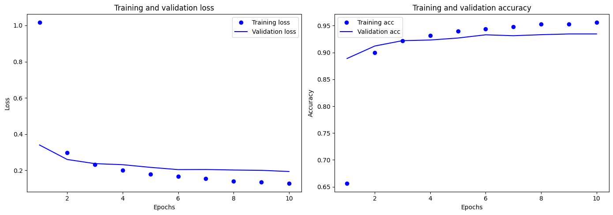
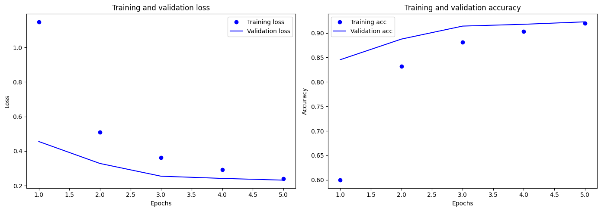

  

# Вебзастосунок *InfinityVision*, розроблений командою *Infinity*, класифікує, за допомогою *Convolutional Neural Network*, завантажені в нього зображення.
# Також, застосунок вміє автоматично знаходити відповіді на запитання з великого обсягу текстових даних із підвантаженого в нього PDF документа, використовуючи Large Language Model.
# Розроблений на базі фреймворку [Django](https://www.djangoproject.com/)
# Модель "model_3_finetuned.h5", що класифікує зображення, натренована на датасеті [CIFAR-10](https://www.kaggle.com/c/cifar-10).

# Convolutional Neural Network
## Model_3_finetuned

В моделі "model_3_finetuned.h5" використаний підхід донавчання (Fine-tuning) на попередньо навченій моделі "model_3_vgg16.h5":

  

* Шари з блоків block4 і block5 VGG16 розморожуються для повторного навчання.
* На основі базової моделі додаються власні шари для класифікації.
* Модель дообучується з новими гіперпараметрами, використовуючи збільшення даних (аугментацію).

### Точність:

### Історія тренування "model_3_finetuned.h5":

  

### Матриця невідповідностей:

  

## Основна модель Model_3_vgg16

### Гіперпараметри:
* img_size: Встановлює розмір зображень у 128x128 пікселів.
* num_classes: Кількість класів для класифікації (10 класів у CIFAR-10).
* batch_size: Розмір батчу під час навчання (512).
* epochs: Кількість епох для навчання (5).

### Створення базової моделі VGG16:
* VGG16: Використовується попередньо навчена модель VGG16 (без верхніх шарів), яка завантажує попередньо навчені ваги з ImageNet.
* base_model.trainable встановлюється у True, що дозволяє повторно навчати всі шари базової моделі.

### Додавання класифікаційної частини:
* Flatten: Вихідні дані базової моделі згладжуються в один вектор.
* Dense (256 нейронів): Додається повнозв'язний шар з 256 нейронами та функцією активації ReLU.
* Dropout (0.5): Додається шар Dropout для запобігання перенавчанню.
* Dense (num_classes): Вихідний шар із 10 нейронами (по одному на кожен клас) та функцією активації Softmax.

### Компіляція моделі:
* Модель компілюється з оптимізатором Adam (з встановленим низьким рівнем навчання), функцією втрат categorical_crossentropy, та метрикою accuracy.

### Збільшення даних (Data Augmentation):
* ImageDataGenerator: Використовується для збільшення даних (аугментації) під час навчання. Параметри збільшення відповідають заданим гіперпараметрам.

### EarlyStopping колбек:
* EarlyStopping: Застосовується для зупинки навчання, якщо показник валідації не покращується протягом заданої кількості епох (5), з автоматичним відновленням найкращих ваг.

## Модель VGG16 загалом містить 23 шари:

  

### Базові
* 1 вхідний шар "input_2"
* 13 згорткових шарів.
* 5 шари підвибірки (Max Pooling), по одному після кожного з блоків згорткових шарів.
### Класифікаційна частина
* flatten_1: Шар Flatten, який розплющує тривимірний тензор у вектор розміром 8192 (4x4x512).
* dense_2: Повнозв'язний шар (Dense) з 256 нейронами та активацією ReLU.
* dropout_1: Шар Dropout з коефіцієнтом 0.5, який випадково вимикає половину нейронів під час кожної ітерації навчання.
* dense_3: Вихідний повнозв'язний шар (Dense) з 10 нейронами (по одному для кожного класу CIFAR-10) і активацією softmax для передбачення ймовірності кожного класу.

  

### Точність:

### Історія тренування:

  

### Матриця невідповідностей:

  

# Large Language Model
## Модель [roberta-base-squad2](https://huggingface.co/deepset/roberta-base-squad2#about-us)

### Модель roberta-base-squad2 є модифікованою версією архітектури RoBERTa, спеціально налаштованою для завдання відповіді на запитання на основі тексту, 
### відомого як SQuAD2.0 (Stanford Question Answering Dataset).

  

### Основні характеристики deepset/roberta-base-squad2:
* Архітектура RoBERTa: Модель базується на модифікованій версії BERT, де основну увагу приділено оптимізації продуктивності шляхом зменшення довжини послідовностей і використання більшої кількості тренувальних даних.
* Задача SQuAD2.0: Ця модель натренована на SQuAD2.0, де крім відповіді на питання, модель повинна визначити, чи питання має відповідь у тексті.
* Тонке налаштування: Модель була додатково налаштована на конкретні вимоги задачі SQuAD2.0, щоб досягти кращої точності в контекстах, де немає відповіді.

  

