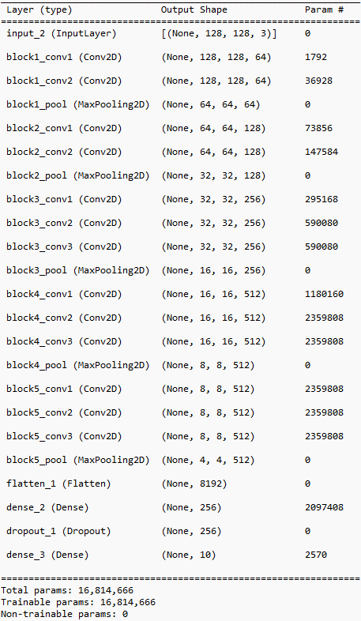

  

# Вебзастосунок *InfinityVision*, розроблений командою *Infinity*, класифікує завантажені в нього зображення за допомогою *Convolutional Neural Network*.
# Розроблений на базі фреймворку [Django](https://www.djangoproject.com/)
# Модель "model_3_finetuned.h5", що класифікує зображення, натренована на датасеті [CIFAR-10](https://www.kaggle.com/c/cifar-10).

## Model_3_finetuned

В моделі "model_3_finetuned.h5" використаний підхід донавчання (Fine-tuning) на попередньо навченій моделі "model_3_vgg16.h5":

  

* Шари з блоків block4 і block5 VGG16 розморожуються для повторного навчання.
* На основі базової моделі додаються власні шари для класифікації.
* Модель дообучується з новими гіперпараметрами, використовуючи збільшення даних (аугментацію).

### Точність:

### Історія тренування "model_3_finetuned.h5":

  

### Матриця невідповідностей:

  

## Основна модель Model_3_vgg16

### Гіперпараметри:
* img_size: Встановлює розмір зображень у 128x128 пікселів.
* num_classes: Кількість класів для класифікації (10 класів у CIFAR-10).
* batch_size: Розмір батчу під час навчання (512).
* epochs: Кількість епох для навчання (5).

### Створення базової моделі VGG16:
* VGG16: Використовується попередньо навчена модель VGG16 (без верхніх шарів), яка завантажує попередньо навчені ваги з ImageNet.
* base_model.trainable встановлюється у True, що дозволяє повторно навчати всі шари базової моделі.

### Додавання класифікаційної частини:
* Flatten: Вихідні дані базової моделі згладжуються в один вектор.
* Dense (256 нейронів): Додається повнозв'язний шар з 256 нейронами та функцією активації ReLU.
* Dropout (0.5): Додається шар Dropout для запобігання перенавчанню.
* Dense (num_classes): Вихідний шар із 10 нейронами (по одному на кожен клас) та функцією активації Softmax.

### Компіляція моделі:
* Модель компілюється з оптимізатором Adam (з встановленим низьким рівнем навчання), функцією втрат categorical_crossentropy, та метрикою accuracy.

### Збільшення даних (Data Augmentation):
* ImageDataGenerator: Використовується для збільшення даних (аугментації) під час навчання. Параметри збільшення відповідають заданим гіперпараметрам.

### EarlyStopping колбек:
* EarlyStopping: Застосовується для зупинки навчання, якщо показник валідації не покращується протягом заданої кількості епох (5), з автоматичним відновленням найкращих ваг.

## Модель VGG16 загалом містить 21 шар:
* 13 згорткових шарів.
* 3 шари підвибірки (Max Pooling), по одному після кожного з блоків згорткових шарів.
* 3 повнозв’язних (Dense) шари: останні шари, які зазвичай використовуються для класифікації (у класичній VGG16 архітектурі). Однак, у цьому коді вони замінені на інші шари.
* 2 шари активації: для останнього вихідного шару використовується Softmax

  

### Точність:

### Історія тренування:

  

### Матриця невідповідностей:

  

